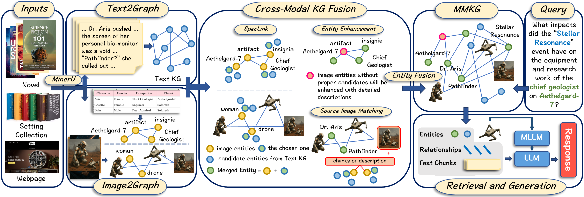

<h3 align="center">🎉 MMGraphRAG</h3>

<p align="center">
  <b>✨ A Multi-Modal Knowledge Graph RAG Framework ✨</b>
</p>

<p align="center">
  <i>从文档到多模态知识图谱，一站式多模态GraphRAG解决方案</i>
</p>

---

## 🌟 核心特性

<table>
<tr>
<td width="50%">

### 📊 多模态知识图谱
- **文本 + 图像** 统一建模
- 基于 YOLO 的智能图像分割
- 多模态实体融合（谱聚类算法）

</td>
<td width="50%">

### � 智能 RAG 检索
- 语义相似度实体检索
- 多模态上下文增强回答
- 支持图表相关问答

</td>
</tr>
<tr>
<td width="50%">

### 🖼️ 交互式可视化
- **内置 Web 可视化服务器**
- 力导向图谱浏览
- 实时搜索与子图高亮
- 点击查看实体详情

</td>
<td width="50%">

### ⚡ 灵活易用
- 命令行一键构建
- 支持 MinerU / PyMuPDF 双引擎
- LLM 缓存加速重复运行

</td>
</tr>
</table>

---

## 📖 关于项目



该图展示了MMGraphRAG的完整工作流程。
本项目基于对nano-graphrag的修改，以支持多模态输入（移除了与社区相关的代码）。图像处理部分使用YOLO和多模态大语言模型（MLLM）将图像转换为场景图。随后，融合部分采用谱聚类方法选择候选实体，结合文本知识图谱和图像知识图谱，构建多模态知识图谱。


我们创建的跨模态实体链接（CMEL, Cross-Modal Entity Linking）数据集位于此处。

https://github.com/wanxueyao/CMEL-dataset

---

## 🔧 环境配置

### 依赖安装

#### 核心依赖

```bash
pip install openai                    # LLM API 调用
pip install sentence-transformers     # 文本嵌入
pip install networkx                  # 图谱存储
pip install numpy                     # 数值计算
pip install scikit-learn              # 向量相似度计算
pip install Pillow                    # 图像处理
pip install tqdm                      # 进度条
pip install tiktoken                  # 文本分块 Token 计算
pip install ultralytics               # YOLO 图像分割
pip install opencv-python             # 图像处理（cv2）
```

#### 可视化服务器依赖

```bash
pip install flask                     # Web 服务器框架
pip install flask-cors                # 跨域支持
```

#### PDF 解析依赖

本项目支持两种 PDF 解析方案，**至少安装其中一种**：

| 方案 | 安装命令 | 特点 |
|------|----------|------|
| **MinerU**（推荐） | `pip install -U "mineru[all]"` | 解析质量更高，支持复杂排版，能更好地提取图像上下文 |
| **PyMuPDF** | `pip install pymupdf` | 轻量级，安装简单，适合简单 PDF |

> **切换方式**: 在 `src/parameter.py` 中设置 `USE_MINERU = True/False`
>
> **降级机制**: 如果 MinerU 不可用，系统会自动降级为 PyMuPDF

### 模型配置

本项目需要配置 **三类模型**，均在 `src/parameter.py` 中设置：

#### 1. 文本 LLM（必需）
用于文本实体提取、关系构建等任务。需配置 OpenAI 兼容 API：

```python
API_KEY = "your-api-key"
API_BASE = "https://your-api-endpoint/v1"
MODEL_NAME = "qwen3-max"  # 或其他文本模型
```

#### 2. 多模态 LLM（必需）
用于图像理解、视觉实体提取等任务。需配置支持图像输入的 API：

```python
MM_API_KEY = "your-api-key"
MM_API_BASE = "https://your-api-endpoint/v1"
MM_MODEL_NAME = "qwen-vl-max"  # 或其他多模态模型
```

#### 3. Embedding 模型（必需）
用于实体向量化和语义检索，在 `src/parameter.py` 中自行配置。

```python
EMBEDDING_MODEL_DIR = './models/all-MiniLM-L6-v2'
EMBED_MODEL = SentenceTransformer(EMBEDDING_MODEL_DIR, device="cpu")
```

> **提示**: Embedding 模型可使用模型名称自动下载，或手动下载到本地后配置路径。

### MinerU 配置说明

如果选择使用 MinerU：

1. **安装**: `pip install -U "mineru[all]"`
2. **配置**: 详见 [MinerU 官方文档](https://github.com/opendatalab/MinerU)，需要下载模型文件
3. **验证**: 确保MinerU能独立运行再进行下一步。

---

## ⚙️ 参数配置

所有核心参数均在 `src/parameter.py` 中定义：

### 目录配置

| 参数 | 说明 | 默认值 |
|------|------|--------|
| `INPUT_PDF_PATH` | 输入PDF文件路径 | - |
| `CACHE_PATH` | LLM响应缓存目录 | `cache` |
| `WORKING_DIR` | 中间处理文件目录 | `working` |
| `OUTPUT_DIR` | 最终图谱输出目录 | `output` |
| `MMKG_NAME` | 输出图谱名称 | `mmkg_时间戳` |

### 处理配置

| 参数 | 说明 | 默认值 |
|------|------|--------|
| `USE_MINERU` | 是否使用MinerU进行PDF预处理 | `True` |
| `ENTITY_EXTRACT_MAX_GLEANING` | 文本实体提取最大迭代次数 | `0` |
| `ENTITY_SUMMARY_MAX_TOKENS` | 实体摘要最大Token数 | `500` |
| `SUMMARY_CONTEXT_MAX_TOKENS` | 摘要上下文最大Token数 | `10000` |

### RAG 检索配置

| 参数 | 说明 | 默认值 |
|------|------|--------|
| `QueryParam.top_k` | 检索返回的实体数量 | `5` |
| `QueryParam.response_type` | 回答风格类型 | `Detailed System-like Response` |
| `QueryParam.local_max_token_for_local_context` | 本地上下文最大Token数 | `4000` |
| `QueryParam.number_of_mmentities` | 多模态实体数量 | `3` |
| `QueryParam.local_max_token_for_text_unit` | 文本单元最大Token数 | `4000` |
| `RETRIEVAL_THRESHOLD` | 检索相似度阈值 | `0.2` |

---

## 🚀 使用说明

### 快速开始

```bash
# 1️⃣ 构建知识图谱
python main.py -i path/to/your/document.pdf

# 2️⃣ 进行问答
python main.py -q "你的问题"

# 3️⃣ 启动可视化 ✨
python main.py -s
# 🌐 访问 http://localhost:8080 查看交互式图谱
```

### 构建知识图谱

```bash
# 使用指定PDF文件构建图谱
python main.py -i path/to/your/document.pdf

# 指定工作目录和输出目录
python main.py -i document.pdf -w ./working -o ./output

# 使用PyMuPDF方法处理PDF（替代MinerU）
python main.py -i document.pdf -m pymupdf

# 强制重新构建（清空工作目录）
python main.py -i document.pdf -f

# 显示详细调试日志
python main.py -i document.pdf -v
```

### RAG 查询

```bash
# 对已构建的图谱进行查询
python main.py -q "你的问题"

# 指定检索参数
python main.py -q "你的问题" --top_k 10 --response_type "简洁回答"

# 如果图谱不存在，会自动先构建再查询
python main.py -i document.pdf -q "你的问题"
```

### 🖼️ 可视化服务器

内置的 Web 可视化服务器让你可以直观地探索知识图谱：

```bash
# 启动知识图谱可视化服务器
python main.py -s

# 指定端口和图谱文件
python main.py -s --port 8888 --graph path/to/graph.graphml
```

**可视化功能亮点**：
- 🔮 **力导向布局**：自动优化节点位置，清晰展示图谱结构
- 🔍 **实时搜索**：快速定位感兴趣的实体节点
- 🎯 **子图高亮**：输入问题，高亮显示相关实体和连接
- 📋 **详情面板**：点击节点查看实体描述、类型等详细信息
- 🎨 **类型着色**：不同实体类型使用不同颜色，一目了然

### 命令行参数一览

| 参数 | 短选项 | 说明 |
|------|--------|------|
| `--input` | `-i` | PDF文件路径 |
| `--working` | `-w` | 中间工作目录 |
| `--output` | `-o` | 最终输出目录 |
| `--method` | `-m` | PDF预处理方法 (`mineru`/`pymupdf`) |
| `--force` | `-f` | 强制清空工作目录重新构建 |
| `--verbose` | `-v` | 显示详细调试日志 |
| `--query` | `-q` | 执行RAG查询 |
| `--top_k` | - | 检索实体数量 |
| `--response_type` | - | 回答风格 |
| `--server` | `-s` | 启动可视化服务器 |
| `--port` | - | 服务器端口 (默认: 8080) |
| `--graph` | - | 指定图谱文件路径 |

---

## 📁 示例文件

`examples/` 目录包含完整的使用示例，展示了从PDF输入到知识图谱构建及问答评测的全流程：

### 目录结构说明

```
examples/
├── example_input/          # 📥 输入文件
│   ├── 2020.acl-main.45.pdf   # 示例PDF：一篇关于NLP的学术论文
│   └── 13_qa.jsonl            # 问答数据集：包含基于该论文的13个问题（Text/Multimodal）及标准答案
│
├── example_working/        # ⚙️ 中间处理结果（自动生成）
│   ├── 2020.acl-main.45/      # PDF预处理产物（Markdown文本、布局信息）
│   ├── images/                # 从PDF中提取的原始图像文件
│   ├── graph_*.graphml        # 各阶段的中间图谱（文本图谱、图像图谱）
│   └── kv_store_*.json        # 键值存储数据（Text Chunks, Image Descriptions等）
│
├── example_output/         # 📤 最终输出结果
│   ├── example_mmkg.graphml   # 最终融合后的多模态知识图谱
│   ├── example_mmkg_emb.npy   # 图谱节点的Embedding向量
│   ├── example_mmkg_report.md # 构建统计报告（节点数、实体分布等）
│   └── retrieval_log.md       # RAG查询的详细日志
│
├── cache/                  # 💾 缓存数据
│   └── *.json                 # LLM API响应缓存，加速重复运行
│
├── paper/                  # 📄 项目资料
│   ├── framework.png          # 系统架构图
│   └── mmgraphrag.pdf         # 本项目相关论文/文档
│
├── docqa_example.py        # 🧪 问答评测脚本
└── docqa_results.md        # 📊 评测结果报告
```

### 示例文档与评测

- **示例文档** (`2020.acl-main.45.pdf`): 用于演示系统处理学术论文的能力，包含丰富的文本和图表。
- **评测脚本** (`docqa_example.py`): 一个一键式评测工具，执行以下流程：
    1. 自动读取示例PDF并构建知识图谱。
    2. 加载 `13_qa.jsonl` 中的问题（涵盖纯文本问答和多模态图表问答）。
    3. 使用构建好的图谱进行RAG检索和回答。
    4. 生成详细的评测报告 `docqa_results.md`，对比模型回答与标准答案。

运行评测：
```bash
python examples/docqa_example.py
```

---

<p align="center">
  <i>Letting Hues Quietly weave through knowledge graph 🎨</i><br>
  <i>a small graph with big dreams ✨</i>
</p>
